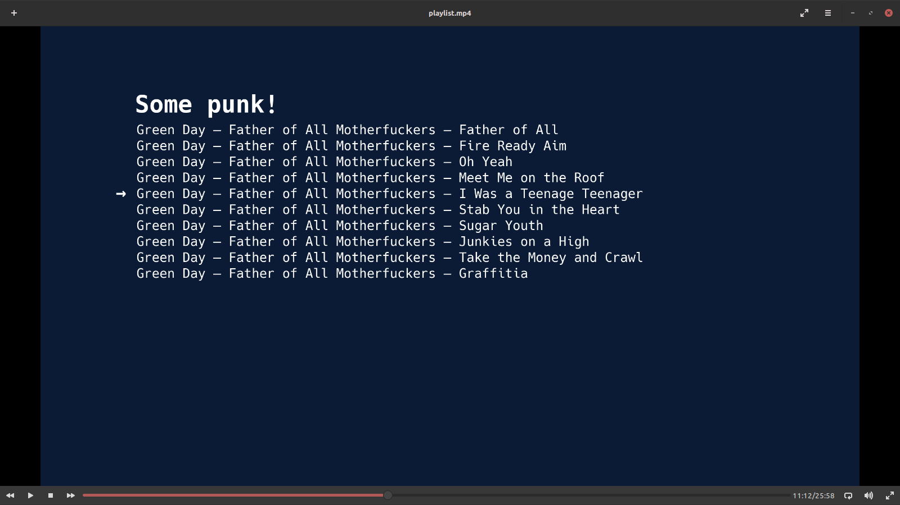
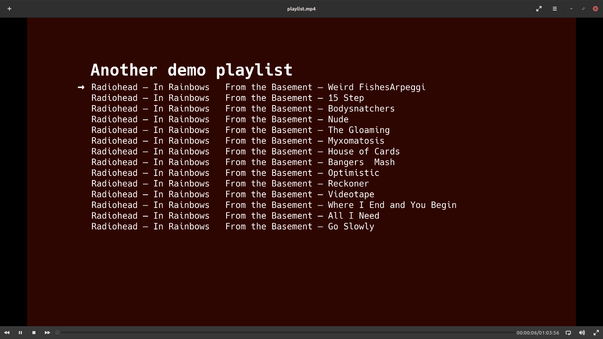
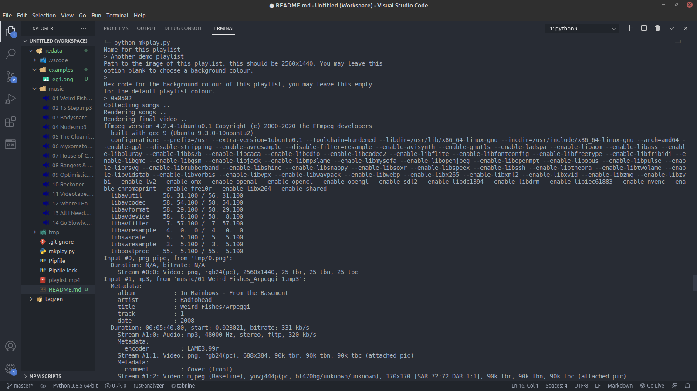

# mkplay

Extendible video playlist visualiser

## In action

- Real world usage: [Link](https://www.youtube.com/watch?v=5kCtzdOUTFw)

Local screenshots:





## About

Once music is added to the `music/` directory beside the script, you may run `mkplay.py` and it will automatically generate a mp4 playlist video for you, containing all the songs from the directory like magic 🌠

This script was designed to handle many naming conventions so `THIS.IS-A VALID   name.mp3` is easily understood. Metadata helps the process and is automatically picked up but in order to keep a specific ordering of a playlist, you may use `0`, `1`, `2`, etc at the start of the tracks (as long as the metadata does not contain this).

Please note that an internet connection is required to use this script as it uses my local [tagzen](https://github.com/owez/tagzen) instance for better quality song metadata.

## Installation

To install mkplay, you need to first install [ffmpeg](https://ffmpeg.org/) along with [python](https://www.python.org/) and the [pipenv](https://pipenv.pypa.io/en/latest/) package.

Once these are installed, you may clone this repository and run `pipenv install` to install the required dependencies this script needs and then simply:

```shell
$ pipenv run python mkdata.py
```

Note that you also need to populate the `music/` folder with music and have an image at hand if you'd like to put it in the background!

## Customizing

If you'd like to customize the positioning of any of the video elements or change the default directories, you may edit the simple-to-use variables at the top of the `mkplay.py` script. Don't worry, it doesnt bite!
